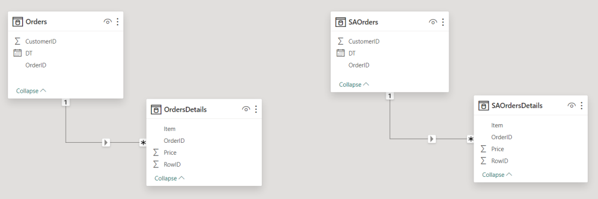
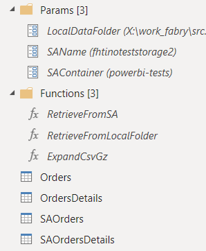
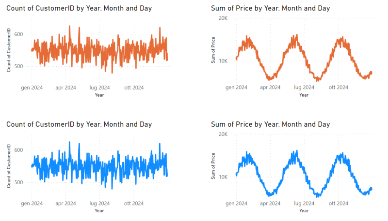

# powerbi-multi-csv-gz

**A practical example of how to load a bunch of csv, gz compressed, data files into Power BI.**

Scenario:
- orders and orders-details
- data stored as csv gzip file (e.g. filename.czv.gz)
- csv set of data, splitted in many files (file_0, file_1, etc.)
- case A: files stored on local file system
- case B: files stored on Azure Blob Storage Account

The PowerBI project, under PowerBI_project folder, cycles over the list of files, uncompress them and load the data into PowerBI. 

| Source | Imported data |
|--|--|
|  |  |

 

The final model, has 4 tables: 2 filled with data from local file system and 2 filled with data from Azure Storage Account. 

 

The M code has been divided in reusable functions:

 

The data, coming from the two sources, are the same.

