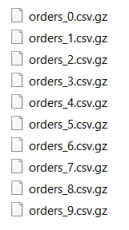
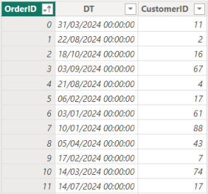

# powerbi-multi-csv-gz

A practical example of how to load a bunch of csv, gz compressed, data files into Power BI.

Below an "Orders" set of data. The whole set comes as a series of csv, gz compressed, files. The PowerBI project under PowerBI_project folder, cycles over the list of files, uncompress them and load the data into PowerBI.

  

| Source | Imported data |
|--|--|
|  |  |

  

